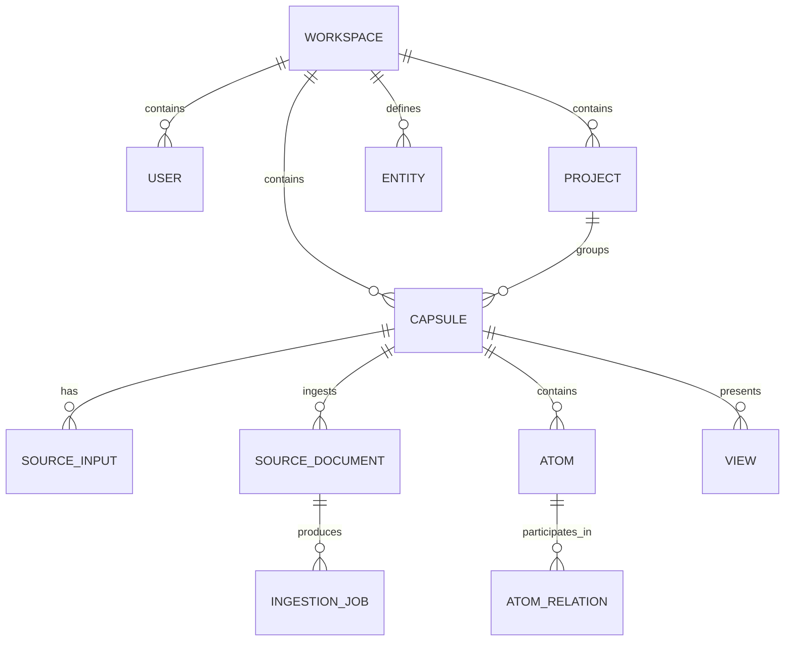
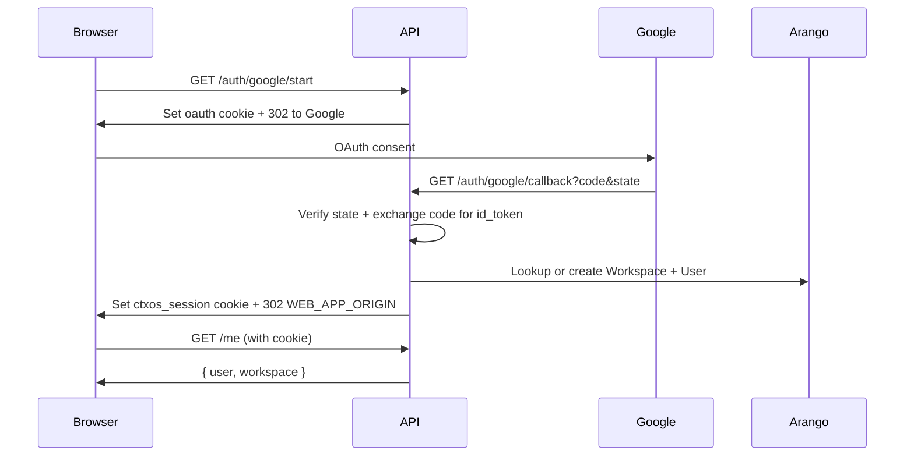
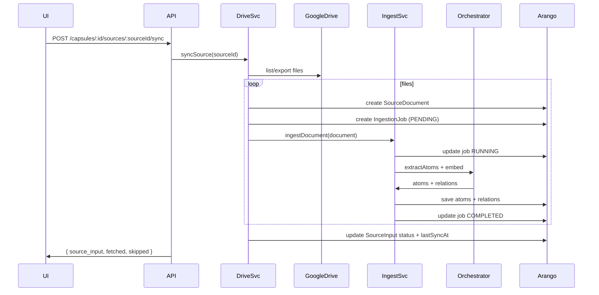

# ContextOS v1 architecture blueprint

> This document describes the **end‑to‑end system architecture** for ContextOS v1:
> UI/representation layer, Knowledge Core, ingestion/connectors, external document
> surfaces, and orchestration. It is intended as the canonical reference for
> engineers, PMs, and AI agents working on the platform.

---

## Table of contents

1. [Design goals and principles](#design-goals-and-principles)
2. [High‑level system map](#high-level-system-map)
3. [Layers and components](#layers-and-components)
4. [Domain model](#domain-model)
5. [GraphStore abstraction](#graphstore-abstraction)
6. [HTTP APIs](#http-apis)
7. [MCP surface (future)](#mcp-surface-future)
8. [Configuration & secrets](#configuration--secrets)
9. [Key flows](#key-flows)
10. [Security & tenancy](#security--tenancy)
11. [Deployment topologies](#deployment-topologies)
12. [Evolution roadmap](#evolution-roadmap)

---

## Design goals and principles

### Goals

- **Clear, enforceable boundaries**
  - Representation/UI concerns are separated from knowledge storage and orchestration.
  - Connector/ingestion responsibilities are isolated from interactive query paths.
- **Multi‑tenant from day one**
  - Every object is scoped to a `workspaceId`.
  - All access checks and queries are workspace‑aware.
- **UI as representation, not source of truth**
  - UI may own **view‑local** state (filters, layouts, persona settings) but not canonical knowledge.
  - Knowledge Core is the single source of truth for capsules, atoms, relations, and views.
- **Composable knowledge**
  - Knowledge graph is exposed via HTTP and MCP so other tools (agents, CLIs, IDE plugins) can use it without the SPA.
- **Asynchronous ingestion**
  - Connectors run out‑of‑band, with explicit job tracking and failure visibility.
- **Security and auditability**
  - Strong auth, role‑based access, no cross‑workspace data leaks, and clear audit hooks.

### Non‑goals (v1)

- No hard requirement for eventual consistency across all surfaces; short periods of staleness are acceptable with good UX.
- No write‑through editing of external documents (e.g., editing Google Docs directly) – v1 treats external docs as primary and ContextOS as a derived view.

---

## High‑level system map

```mermaid
flowchart LR
  subgraph UI["UI / Representation Layer"]
    React[React SPA] -->|HTTPS JSON| APIGW
    React --> LocalPrefs[User-local state\n(filters, layouts, personas)]
  end

  subgraph Core["Knowledge Core"]
    APIGW[Auth + API Gateway\n(Fastify)] --> KGAPI[Knowledge Graph API]
    KGAPI --> Arango[(ArangoDB\ncollections + edges + vector index)]
    KGAPI --> Orchestrator
    KGAPI --> Search[Search / ranking\n(vector + full-text views)]
  end

  subgraph Ingest["Connectors & Workers"]
    ConnDrive[Google Drive Connector] --> Jobs[Ingestion Jobs\n(queue + workers)]
    ConnGitHub[GitHub Connector (future)] --> Jobs
    Jobs --> KGAPI
  end

  subgraph Docs["External Document Surfaces"]
    GDocs[Google Docs]
    GH[GitHub Issues / PRs]
    Conf[Confluence (future)]
  end

  subgraph Orchestrator["AI Orchestrator"]
    Orchestrator[Orchestrator API\n(HTTP or in-process)] --> LLM[(LLM Provider)]
  end

  React -->|Browser OAuth| GoogleIdP[(Google Identity)]
  ConnDrive -->|OAuth 2.0| GoogleIdP

  ConnDrive -->|files| GDocs
  ConnGitHub -->|repos| GH

  KGAPI -->|MCP| MCPClients[External tools & agents]
```

---

## Layers and components

### 1. UI / Representation layer

**Responsibilities**
- Provide the main ContextOS experience (capsule dashboard, assistant rail, document canvas).
- Manage **view‑local state**:
  - Selected capsule, filters, sort order.
  - Layout preferences, theme, persona selector.
  - Client‑only wizard state (e.g., onboarding steps).
- Orchestrate flows by calling backend APIs; never directly hits databases or connectors.

**Key design points**
- React SPA routed via `react-router-dom`, hosted on a static origin.
- Uses `VITE_API_URL` to talk to the API gateway.
- Uses `GET /me` to:
  - Confirm authentication.
  - Obtain `workspace` context (name, slug).
  - Later: receive serialized user profile preferences.
- Sends cookies (`credentials: 'include'`) so the backend can enforce sessions.

**Optional BFF**
- In v1 we do not introduce a separate BFF process; the Fastify API doubles as gateway + core.
- In v2, we can add a lightweight BFF to:
  - Aggregate multiple knowledge‑core queries for low‑latency page loads.
  - Provide feature‑flagged endpoints for experimental UI flows without touching the core.

---

### 2. Knowledge Core (API + Graph)

**Responsibilities**
- Own the canonical **knowledge graph**:
  - Workspaces, users, projects, capsules.
  - Source inputs, documents, atoms, relations, views.
- Provide reads and writes over HTTP (and MCP in the future).
- Enforce:
  - Authentication (via session cookies).
  - Authorization and workspace scoping.
  - Basic input validation via Zod schemas.
- Integrate with the AI Orchestrator:
  - Atom extraction and embedding.
  - QA (question answering).
  - View generation.

**Internal structure**

```mermaid
flowchart TB
  subgraph HTTP["HTTP layer"]
    Routes[routes (Fastify)] --> Services
  end

  subgraph Services["Application services"]
    AuthSvc[AuthService\n(Google + sessions)]
    ProjectSvc[ProjectService]
    CapsuleSvc[CapsuleService]
    IngestSvc[IngestionService]
    QaSvc[QaService]
    ViewSvc[ViewService]
    DriveSvc[GoogleDriveService]
  end

  subgraph Infra["Infrastructure"]
    GraphStore[GraphStore interface\n(InMemory / Arango)]
    OrchestratorClient[Orchestrator client\n(Local / HTTP / Gemini)]
    TokenStore[TokenStore\n(Google OAuth tokens)]
  end

  Routes --> AuthSvc
  Routes --> ProjectSvc & CapsuleSvc & IngestSvc & QaSvc & ViewSvc & DriveSvc
  Services --> GraphStore
  Services --> OrchestratorClient
  DriveSvc --> TokenStore
  GraphStore --> ArangoDB[(ArangoDB)]
```

---

### 3. Ingestion & connectors

**Responsibilities**
- Connect to external systems (Google Drive, GitHub, etc.).
- Pull raw documents, normalize them, and push into the Knowledge Core:
  - Create `SourceInput` records.
  - Create `SourceDocument` rows with raw text + metadata.
  - Start ingestion jobs that produce atoms and relations.

**Google Drive connector (current)**
- `GoogleDriveService`:
  - Starts OAuth auth flows and maintains ephemeral state.
  - Stores tokens encrypted via `FileTokenStore`.
  - On `sync`:
    - Lists files, fetches content, creates `SourceDocument` records, and ingestion jobs.
    - Updates `SourceInput` status and `lastSyncAt`.

**Future: Dedicated workers**
- Move heavy work (content fetch + ingest) into a dedicated **worker pool**:
  - API enqueues jobs.
  - Workers listen to queue and call the same `IngestionService`.
  - UI observes progress via job polling or notifications.

---

### 4. Document surfaces

**Responsibilities**
- Keep the **primary document body** wherever the team prefers:
  - Google Docs for long‑form docs.
  - GitHub Issues/PRs for engineering flows.
  - Confluence or Notion (future).
- ContextOS links to these docs and extracts knowledge from them into atoms.
- A document adapter should:
  - Provide the mapping between document IDs and capsules.
  - Expose metadata (URL, last modified time, author).
  - Signal **staleness** back to the Knowledge Core when the document changes.

**Conceptual separation**
- ContextOS is the **knowledge spine**; document surfaces are views into that knowledge.
- The same canonical atom may be used by multiple external documents.

---

### 5. Orchestrator

**Responsibilities**
- Normalize all LLM interactions:
  - Atom extraction from raw text.
  - Embedding generation (deterministic where possible).
  - QA summarization and answer generation.
  - View/document generation.

**Pluggable providers**
- `ORCHESTRATOR_PROVIDER` chooses:
  - `LOCAL`: in‑process deterministic stub.
  - `HTTP`: external orchestrator service (Python FastAPI in this repo).
  - `GEMINI`: direct provider integration.

#### Extraction contract

The extraction contract between Knowledge Core and Orchestrator is explicit so
that multiple providers can be swapped in:

```ts
type ExtractAtomsRequest = {
  documentId: string;
  capsuleId: string;
  text: string;
  title: string;
};

type ExtractedAtom = {
  id: string;                  // orchestrator-assigned UUID
  statement: string;
  type: AtomKind;
  confidence: number;          // 0–1
  sourceSpan?: string;         // e.g. character range or paragraph id
  meta?: Record<string, unknown>;
};

type ExtractAtomsResponse = {
  atoms: readonly ExtractedAtom[];
  relations: readonly {
    fromAtomId: string;
    toAtomId: string;
    type: AtomRelationType;
    confidence: number;
  }[];
};
```

`IngestionService` consumes this contract and is responsible for:

- Deduplicating atoms via `atomHash`.
- Computing per‑type metadata and integrity fields.
- Persisting atoms and relations via `GraphStore`.

In v1, `IngestionService` calls the Orchestrator to generate embeddings for each
atom statement during ingestion and persists the vectors alongside the atoms; a
later version may split **extraction** and **embedding refresh** into separate
job types.

---

## Domain model

At a high level, ContextOS maintains a **multi‑tenant knowledge graph**:



### Workspace

Represents an organization or tenant.

```ts
type Workspace = {
  id: string;
  name: string;
  slug?: string;
  createdAt: Date;
};
```

- `slug` is typically derived from email domain (e.g., `acme-com`).

### User

Workspace‑scoped identity, authenticated via Google SSO.

```ts
type WorkspaceRole = 'OWNER' | 'ADMIN' | 'MEMBER';

type User = {
  id: string;
  email: string;
  name: string;
  avatarUrl?: string;
  workspaceId: string;
  role: WorkspaceRole;
  provider: 'google';
  createdAt: Date;
  lastLoginAt: Date;
};
```

- First user in a workspace is promoted to `OWNER`.

### Project

Logical grouping of capsules within a workspace.

```ts
type Project = {
  id: string;
  name: string;
  description?: string;
  workspaceId: string;
  createdAt: Date;
};
```

### Capsule

Represents a **project brain** – the main unit of knowledge.

```ts
type Capsule = {
  id: string;
  name: string;
  description: string;
  workspaceId: string;
  projectId?: string;
  createdAt: Date;
  // Visibility & integrity rollups
  visibility: 'PRIVATE' | 'RESTRICTED' | 'ORG_PUBLIC';
  allowedUserIds?: readonly string[]; // only for RESTRICTED
  canonicalAtomCount?: number;
  contradictionCount?: number;
  lastIntegrityScore?: number; // 0–100, computed asynchronously
  meta?: Record<string, unknown>; // for future per-capsule flags/settings
};
```

Visibility is enforced at request time (see [Security & tenancy](#security--tenancy))
and is intentionally coarse‑grained for v1. Integrity rollup fields are updated
by a background job after ingestion or atom mutations and may be slightly stale
between recomputes.

### SourceInput

Represents a connection between a capsule and an external source (folder, repo, etc.).

```ts
type SourceProvider = 'GOOGLE_DRIVE'; // extensible
type SourceInputStatus = 'PENDING_AUTH' | 'CONNECTED' | 'SYNCING' | 'ERROR';

type SourceInput = {
  id: string;
  workspaceId: string;
  projectId?: string;
  capsuleId: string;
  provider: SourceProvider;
  status: SourceInputStatus;
  folderId?: string;
  credentialId: string;
  lastSyncAt?: Date;
  error?: string;
  createdAt: Date;
  updatedAt: Date;
};
```

### Entity

Entities provide a light‑weight way to attach structured semantics to atoms
(for example, linking a fact to “API Gateway” or “Payments Team”).

```ts
type Entity = {
  id: string;
  workspaceId: string;
  name: string;      // 'API Gateway'
  kind: string;      // 'SERVICE' | 'TEAM' | 'SYSTEM' | ...
  slug?: string;     // 'api-gateway'
  createdAt: Date;
};
```

In v1, entities are **internal‑only**: they appear on `Atom.subjectEntityId`
and in internal search/faceting, but there is no dedicated public HTTP or
GraphStore CRUD surface for them yet. Ingestion for v1 does not attempt to
deduplicate or normalize entities (for example, “API Gateway” vs
“api gateway”); future versions may introduce entity normalization and merging,
but this is intentionally out of scope for the initial release.

### SourceDocument

Immutable snapshot of a document that has been ingested into a capsule.

```ts
type SourceDocumentType = 'MANUAL' | 'GOOGLE_DOC' | 'GITHUB_ISSUE' | 'OTHER';

type SourceDocument = {
  id: string;
  capsuleId: string;
  workspaceId: string;
  type: SourceDocumentType;
  title: string;
  rawText: string;
  metadata: Record<string, string>; // e.g. driveFileId, modifiedTime
  createdAt: Date;
};
```

### Atom and relations

Atoms are the core knowledge units (facts, decisions, risks, etc.).

```ts
type AtomKind = 'FACT' | 'DECISION' | 'RISK' | 'ASSUMPTION' | 'REQUIREMENT';
type AtomStatus = 'ACTIVE' | 'SUPERSEDED';
type AtomLayer = 'CANONICAL' | 'EXPLORATORY';
type AtomVisibility = 'PRIVATE' | 'RESTRICTED' | 'ORG_PUBLIC';
type AtomSensitivity = 'LOW' | 'MEDIUM' | 'HIGH';

type Atom = {
  id: string;
  capsuleId: string;
  workspaceId: string;
  statement: string;
  type: AtomKind;
  embedding: readonly number[];
  confidenceScore: number;
  atomHash: string;
  // Canonical vs exploratory, status, and sharing
  layer: AtomLayer;
  status: AtomStatus;
  visibility: AtomVisibility;
  sensitivity?: AtomSensitivity;
  // Optional structured triple-style representation
  subjectEntityId?: string; // link to Entity
  predicate?: string;       // e.g. 'ROLLOUT_DATE'
  objectValue?: string;     // e.g. '2025-05-01'
  provenance: {
    sourceDocumentId: string;
    sourceSpan?: string;
  };
  meta?: Record<string, unknown>;
  metaSchemaVersion?: string;
  createdAt: Date;
};

type AtomRelationType = 'SUPPORTS' | 'CONTRADICTS' | 'RELATED';

type AtomRelation = {
  id: string;
  fromAtomId: string;
  toAtomId: string;
  type: AtomRelationType;
  confidence: number;
};
```

### View

Structured representation of a document generated from atoms.

```ts
type ViewBlockKind = 'heading' | 'paragraph' | 'list' | 'code' | 'table' | 'meta';

type ViewBlock = {
  blockId: string;
  kind: ViewBlockKind;
  text: string;
  metadata?: Record<string, unknown>;
};

type BlockDependency = {
  blockId: string;
  atomIds: readonly string[];
  isDetached: boolean;
};

type ViewStatus = 'DRAFT' | 'IN_REVIEW' | 'APPROVED';

type View = {
  id: string;
  capsuleId: string;
  workspaceId: string;
  templateId: string;
  type: string;
  title: string;
  content: readonly ViewBlock[];
  blockDependencies: readonly BlockDependency[];
  atomIds: readonly string[];
  isStale: boolean;
  status: ViewStatus;
  meta?: Record<string, unknown>;
  createdAt: Date;
  updatedAt: Date;
};
```

Views are immutable text surfaces generated from atoms. `blockDependencies`
declares which atoms contributed to each block and is authoritative for
staleness. Any change to atoms referenced in `blockDependencies.atomIds`
including supersedes or contradictions marks the corresponding blocks, and
therefore the view, as stale by setting `isStale = true` via background jobs;
block‑level or full‑view regeneration then clears the staleness flag.

### IngestionJob

Tracks the lifecycle of ingestion.

```ts
type IngestionJobStatus = 'PENDING' | 'RUNNING' | 'FAILED' | 'COMPLETED';

type IngestionJob = {
  id: string;
  workspaceId: string;
  capsuleId?: string;       // can be inferred via document, but explicit helps
  documentId: string;
  sourceInputId?: string;
  status: IngestionJobStatus;
  errors: readonly string[];
  createdAt: Date;
  updatedAt: Date;
};
```

### CapsuleEvent

`CapsuleEvent` is a reserved event/log record for future “Knowledge Stream” and
activity feeds. It is not required for v1, but anchoring the type in the
domain model keeps future consumers consistent.

```ts
type CapsuleEvent = {
  id: string;
  workspaceId: string;
  capsuleId: string;
  type: 'ATOM_CREATED' | 'RISK_DETECTED' | 'DECISION_RECORDED' | string;
  payload: unknown; // free-form, event-type specific
  createdAt: Date;
  createdByUserId?: string;
};
```

### DocumentTemplate

Templates describe the structure, semantics, and copy scaffolding for views
(e.g. “Technical RFC”, “PR/FAQ”, “Strategy Brief”).

```ts
type DocumentTemplate = {
  id: string;
  workspaceId: string;
  name: string;            // 'Technical RFC'
  type: string;            // maps to View.type
  definition: unknown;     // JSON schema / section definition
  version: number;
  createdAt: Date;
  updatedAt: Date;
};
```

Templates are stored centrally and referenced by `View.templateId`. The frontend
can use them to render sidebars, checklists, and section navigation.

Example template definition (non‑normative) for a simple document:

```jsonc
// Example template definition; backend treats this as opaque JSON
{
  "sections": [
    { "id": "intro", "title": "Introduction", "type": "paragraph" },
    { "id": "risks", "title": "Key Risks", "type": "list" }
  ]
}
```

### AtomFilter

`AtomFilter` is the shared filter contract used by `GraphStore.listAtoms` and
HTTP endpoints that list atoms for a capsule.

```ts
type AtomFilter = {
  type?: AtomKind;
  status?: AtomStatus;
  layer?: AtomLayer;
  visibility?: AtomVisibility;
  q?: string; // optional free-text search
};
```

---

## GraphStore abstraction

The **GraphStore** interface is the key internal seam that allows ContextOS to:

- Run against an in‑memory graph in tests and local dev.
- Use ArangoDB (or another graph backend) in production.
- Keep HTTP routes and application services agnostic of storage details.

```ts
interface GraphStore {
  // Workspaces & users
  createWorkspace(input: WorkspaceCreateInput): Promise<Workspace>;
  findWorkspaceById(id: string): Promise<Workspace | undefined>;
  findWorkspaceBySlug(slug: string): Promise<Workspace | undefined>;

  createUser(input: UserCreateInput): Promise<User>;
  findUserById(id: string): Promise<User | undefined>;
  findUserByEmail(email: string): Promise<User | undefined>;
  listUsers(workspaceId: string): Promise<readonly User[]>;
  updateUserLastLogin(userId: string): Promise<User>;

  // Projects & capsules
  createProject(input: ProjectCreateInput): Promise<Project>;
  listProjects(workspaceId: string): Promise<readonly Project[]>;
  createCapsule(input: CapsuleCreateInput): Promise<Capsule>;
  listCapsules(workspaceId: string): Promise<readonly Capsule[]>;
  findCapsuleById(id: string): Promise<Capsule | undefined>;

  // Sources & documents
  createSourceInput(input: SourceInputCreate): Promise<SourceInput>;
  updateSourceInput(id: string, updates: Partial<SourceInput>): Promise<SourceInput>;
  listSourceInputs(capsuleId: string): Promise<readonly SourceInput[]>;
  findSourceInputById(id: string): Promise<SourceInput | undefined>;
  createSourceDocument(input: SourceDocumentCreateInput): Promise<SourceDocument>;

  // Ingestion jobs
  createIngestionJob(input: IngestionJobCreateInput): Promise<IngestionJob>;
  updateIngestionJob(id: string, status: IngestionJobStatus, errors?: readonly string[]): Promise<IngestionJob>;
  getIngestionJob(id: string): Promise<IngestionJob | undefined>;

  // Atoms & relations
  saveAtoms(atoms: readonly Atom[]): Promise<void>;
  listAtoms(capsuleId: string, filter?: AtomFilter): Promise<readonly Atom[]>;
  findAtomById(atomId: string): Promise<Atom | undefined>;
  saveRelations(relations: readonly AtomRelation[]): Promise<void>;
  listRelations(capsuleId: string): Promise<readonly AtomRelation[]>;

  // Views
  createView(input: ViewCreateInput): Promise<View>;
  findViewById(id: string): Promise<View | undefined>;
  updateView(input: ViewUpdateInput): Promise<View>;
}
```

Two concrete implementations exist in the codebase:

- `InMemoryGraphStore` – pure TypeScript maps, ideal for:
  - Unit tests.
  - Local UI prototyping (mocking the graph DB).
  - Demo environments without Arango.
- `ArangoGraphStore` – backed by Arango collections and edges, with:
  - Collections for `workspaces`, `users`, `projects`, `capsules`, `atoms`,
    `atom_relations`, `views`, `source_inputs`, `content_chunks`, `jobs`. In
    v1, the `content_chunks` collection is the physical Arango storage for
    chunked document text that feeds ingestion and QA flows; the
    `SourceDocument` type in this document represents the higher‑level,
    capsule‑scoped document abstraction that orchestrates those chunks.
  - Vector index on `atoms.embedding`.
  - ArangoSearch view for combined text + metadata search.

Application services (capsules, ingestion, QA, views) **only depend on
`GraphStore`**, so swapping implementations does not change route handlers or
frontend contracts. For local development and tests, `InMemoryGraphStore` may
expose additional helpers (such as a `reset`/`deleteAll` method) to wipe state
between runs without extending the core `GraphStore` contract. A future
iteration may also introduce a `searchAtoms` method that formalises text +
metadata search, backed by ArangoSearch in production and simple in‑memory
filtering in dev.

```ts
// Optional dev-only helpers for tests and local prototyping;
// not part of the core GraphStore contract.
interface InMemoryGraphStoreDevExtensions {
  reset(): void;
}
```

---

## HTTP APIs

This section documents the **public HTTP surface** of the API gateway / Knowledge Core.
Types below are **JSON shapes**, not necessarily the exact TypeScript definitions.

### Conventions

- All requests and responses are JSON unless otherwise noted.
- Errors use RFC 7807–style problem details:

```jsonc
{
  "type": "about:blank",
  "title": "Unauthorized",
  "status": 401,
  "detail": "Login required.",
  "instance": "/capsules",
  "request_id": "..."
}
```

### Auth & session

#### `GET /auth/google/start`

- **Purpose**: Begin Google OAuth SSO.
- **Auth**: None.
- **Behavior**:
  - Sets a short‑lived cookie containing `state` and `nonce`.
  - Redirects to Google OAuth consent page.

#### `GET /auth/google/callback?code&state`

- **Purpose**: Complete Google OAuth and create/update user + workspace.
- **Auth**: None (relies on Google).
- **Behavior**:
  - Validates `state` and nonce against cookie.
  - Exchanges `code` for `id_token`.
  - Derives workspace from email domain (or finds existing).
  - Creates or updates `User`.
  - Issues `ctxos_session` httpOnly cookie with a JWT:

```jsonc
// payload (SessionToken)
{
  "sub": "user-id",
  "workspaceId": "workspace-id",
  "role": "OWNER",
  "email": "user@example.com",
  "name": "User Name",
  "exp": 1710000000
}
```

#### `GET /me`

- **Purpose**: Return the current user and workspace context.
- **Auth**: Required (session cookie).
- **Response**:

```jsonc
{
  "user": {
    "id": "user-id",
    "email": "user@example.com",
    "name": "User Name",
    "avatar_url": "https://...",
    "role": "OWNER",
    "workspace_id": "workspace-id"
  },
  "workspace": {
    "id": "workspace-id",
    "name": "Acme Corp",
    "slug": "acme-corp"
  }
}
```

#### `POST /auth/logout`

- **Purpose**: Terminate current session.
- **Auth**: Optional; idempotent.
- **Response**: `204 No Content`, clears `ctxos_session` cookie.

---

### Projects & capsules

#### `POST /projects`

- **Auth**: Required.
- **Request**:

```jsonc
{
  "name": "Payments platform",
  "description": "All capsules for payments initiatives"
}
```

- **Response**:

```jsonc
{
  "project": {
    "id": "proj-123",
    "name": "Payments platform",
    "description": "All capsules for payments initiatives",
    "created_at": "2025-02-01T12:00:00.000Z"
  }
}
```

#### `GET /projects`

- **Auth**: Required.
- **Response**:

```jsonc
{
  "projects": [ /* ProjectPayload[] scoped to workspace */ ]
}
```

#### `POST /capsules`

- **Auth**: Required.
- **Request**:

```jsonc
{
  "name": "Launch Capsule",
  "description": "ContextOS launch work brain",
  "project_id": "proj-123"
}
```

- **Response**:

```jsonc
{
  "capsule": {
    "id": "cap-123",
    "name": "Launch Capsule",
    "description": "ContextOS launch work brain",
    "project_id": "proj-123",
    "created_at": "2025-02-01T12:00:00.000Z"
  }
}
```

#### `GET /capsules`

- **Auth**: Required.
- **Response**:

```jsonc
{
  "capsules": [ /* CapsulePayload[] for workspace */ ]
}
```

---

### Knowledge explorer & canonical layer

The following endpoints are designed for the “Knowledge Base” and
canonical/exploratory promotion flows. Some may be introduced after v1 but are
documented here as stable contracts for frontend and agents.

#### `GET /capsules/:capsuleId/knowledge`

- **Auth**: Required.
- **Purpose**: Return a **UX‑friendly**, opinionated slice of a capsule’s
  knowledge for the Knowledge Base view, including summary rollups.
- **Query params** (all optional):
  - `layer`: `CANONICAL` or `EXPLORATORY`.
  - `type`: `FACT|DECISION|RISK|ASSUMPTION|REQUIREMENT`.
  - `status`: `ACTIVE|SUPERSEDED`.
  - `visibility`: `PRIVATE|RESTRICTED|ORG_PUBLIC` (for owners/admins).
  - `q`: free‑text query.
- **Response**:

```jsonc
{
  "atoms": [ /* AtomPayload[] */ ],
  "summary": {
    "canonical_count": 42,
    "exploratory_count": 17,
    "contradiction_count": 3,
    "last_integrity_score": 86
  }
}
```

#### `POST /atoms/:atomId/promote`

- **Auth**: Required; only capsule owners/admins can promote.
- **Purpose**: Promote an exploratory atom to canonical.
- **Request**:

```jsonc
{
  "type": "FACT",                 // optional override
  "visibility": "ORG_PUBLIC"      // optional override
}
```

- **Response**:

```jsonc
{
  "atom": { /* updated AtomPayload with layer='CANONICAL' */ }
}
```

#### `POST /atoms/:atomId/supersede`

- **Auth**: Required.
- **Purpose**: Mark an atom as superseded by another statement.
- **Request**:

```jsonc
{
  "supersedes_version": 1,
  "proposed_statement": "Updated fact statement...",
  "visibility": "ORG_PUBLIC"
}
```

- **Response**:

```jsonc
{
  "superseded": { /* old AtomPayload with status='SUPERSEDED' */ },
  "replacement": { /* new AtomPayload */ }
}
```

By default, the replacement atom inherits the layer, visibility, sensitivity,
and entity fields of the superseded atom; any fields supplied in the request
payload (such as `visibility`) override the inherited values so superseding
flows remain consistent and predictable.

---

### Sources & connectors

#### `POST /connectors/google-drive/start`

- **Auth**: Required.
- **Purpose**: Create a `SourceInput` and return a Google OAuth URL for Drive access.
- **Request**:

```jsonc
{
  "capsule_id": "cap-123",
  "project_id": "proj-123",
  "folder_id": "drive-folder-id"
}
```

- **Response**:

```jsonc
{
  "auth_url": "https://accounts.google.com/...",
  "source_input": {
    "id": "src-123",
    "project_id": "proj-123",
    "capsule_id": "cap-123",
    "provider": "GOOGLE_DRIVE",
    "status": "PENDING_AUTH",
    "folder_id": "drive-folder-id",
    "credential_id": "cred-123",
    "last_sync_at": null,
    "error": null,
    "created_at": "...",
    "updated_at": "..."
  }
}
```

#### `GET /capsules/:capsuleId/sources`

- **Auth**: Required; capsule must belong to current workspace.
- **Response**:

```jsonc
{
  "sources": [ /* SourceInputPayload[] */ ]
}
```

#### `POST /capsules/:capsuleId/sources/:sourceId/sync`

- **Auth**: Required.
- **Purpose**: Fetch latest files from Drive and create ingestion jobs.
- **Response**:

```jsonc
{
  "source_input": { /* updated SourceInputPayload */ },
  "fetched": 5,
  "skipped": 1
}
```

---

### Documents & ingestion

#### `POST /capsules/:capsuleId/documents`

- **Auth**: Required.
- **Purpose**: Ingest a manual doc or connector‑provided text.
- **Request**:

```jsonc
{
  "title": "SLOs for ContextOS API",
  "type": "MANUAL",
  "raw_text": "Here are the SLOs...",
  "metadata": {
    "author": "user@example.com",
    "source": "manual"
  }
}
```

- **Response**:

```jsonc
{
  "document": { /* DocumentPayload */ },
  "job": { /* JobPayload */ },
  "atoms_created": [ /* AtomPayload[] */ ]
}
```

For small manual documents, ingestion may complete inline and return
`atoms_created`. For larger documents or connector‑driven imports, `atoms_created`
may be empty and clients should rely on the `job` status for asynchronous
progress.

#### `GET /ingestion-jobs/:jobId`

- **Auth**: Required.
- **Response**:

```jsonc
{
  "job": {
    "id": "job-123",
    "document_id": "doc-123",
    "source_input_id": "src-123",
    "status": "COMPLETED",
    "errors": [],
    "created_at": "...",
    "updated_at": "..."
  }
}
```

---

### Knowledge graph & QA

#### `GET /capsules/:capsuleId/atoms`

- **Auth**: Required.
- **Purpose**: Low‑level listing of raw atoms in a capsule, primarily for tools
  and agents. Mirrors the `AtomFilter` contract.
- **Query params** (all optional):
  - `type`: `FACT|DECISION|RISK|ASSUMPTION|REQUIREMENT`.
  - `status`: `ACTIVE|SUPERSEDED`.
  - `layer`: `CANONICAL|EXPLORATORY`.
  - `visibility`: `PRIVATE|RESTRICTED|ORG_PUBLIC` (subject to permissions).
  - `q`: free‑text query.
- **Response**:

```jsonc
{
  "atoms": [ /* AtomPayload[] */ ]
}
```

#### `GET /atoms/:atomId`

- **Auth**: Required.
- **Response**:

```jsonc
{
  "atom": { /* AtomPayload */ }
}
```

#### `POST /capsules/:capsuleId/qa`

- **Auth**: Required.
- **Request**:

```jsonc
{
  "question": "What are the main launch risks for ContextOS?"
}
```

- **Response**:

```jsonc
{
  "answer": "The primary risks are ...",
  "atoms_used": [ /* AtomPayload[] */ ]
}
```

- **Behavior**: `QaService` embeds the question, selects a top‑N set of active
  atoms via vector similarity (and optional keyword filters) using the capsule’s
  embeddings, then sends the question plus those atoms to the Orchestrator for
  grounded answer generation; `atoms_used` is the subset the Orchestrator
  actually relied on as evidence.

#### Views (spec routes)

These endpoints are **experimental** in v1 and primarily support document/view
generation experiments. Shapes are intentionally small and may evolve.

##### `POST /views`

- **Auth**: Required.
- **Purpose**: Generate a view from a capsule and template.
- **Request**:

```jsonc
{
  "capsule_id": "cap-123",
  "template_id": "tmpl-rfc",
  "title": "ContextOS Launch RFC"
}
```

- **Response**:

```jsonc
{
  "view": {
    "id": "view-123",
    "capsule_id": "cap-123",
    "template_id": "tmpl-rfc",
    "type": "TECH_RFC",
    "title": "ContextOS Launch RFC",
    "content": [ /* ViewBlock[] */ ],
    "block_dependencies": [ /* BlockDependency[] */ ],
    "atom_ids": [ "atom-1", "atom-2" ],
    "is_stale": false,
    "status": "DRAFT",
    "meta": { /* optional per-view metadata */ },
    "created_at": "...",
    "updated_at": "..."
  }
}
```

##### `GET /views/:viewId`

- **Auth**: Required.
- **Purpose**: Retrieve a generated view (for reading or refinement).
- **Response**:

```jsonc
{
  "view": { /* same shape as POST /views response */ }
}
```

---

### Contradictions & integrity (future)

To support “What changed?” and contradiction review flows, we reserve:

#### `GET /capsules/:capsuleId/conflicts`

- **Auth**: Required.
- **Purpose**: List contradictions within a capsule grouped by subject/predicate.
- **Response** (shape subject to refinement):

```jsonc
{
  "conflicts": [
    {
      "id": "conflict-1",
      "subject_entity_id": "entity-api-gateway",
      "predicate": "ROLLOUT_DATE",
      "atoms": [
        { "id": "atom-a", "statement": "...", "layer": "CANONICAL" },
        { "id": "atom-b", "statement": "...", "layer": "EXPLORATORY" }
      ]
    }
  ]
}
```

#### `GET /capsules/:capsuleId/integrity`

- **Auth**: Required.
- **Purpose**: Provide a capsule‑level integrity snapshot.
- **Response**:

```jsonc
{
  "canonical_count": 42,
  "exploratory_count": 17,
  "contradiction_count": 3,
  "last_integrity_score": 86,
  "updated_at": "2025-02-01T12:00:00.000Z"
}
```

---

## MCP surface (future)

The Knowledge Core is a natural fit for an MCP tool surface, enabling agents and
external tools to:

- Discover capsules and workspaces.
- Query atoms with filters and semantic search.
- Retrieve supporting evidence for a given claim.
- Propose new atoms or updates.

Example MCP tools (conceptual):

- `list_capsules`: input `{ workspace_id }`, output capsule summaries.
- `query_atoms`: input `{ capsule_id, filter, query? }`, output atoms + scores.
- `upsert_atoms`: input `[{ capsule_id, statement, type, provenance, meta? }]`.
- `get_evidence`: input `{ atom_id }`, output `SourceDocument` snippets.

Auth for MCP tools should reuse the same JWT session or a derived access token
scoped to a workspace.

---

## Configuration & secrets

### Backend (Fastify / Knowledge Core)

| Variable               | Required | Example                                | Description                                                     |
|------------------------|----------|----------------------------------------|-----------------------------------------------------------------|
| `PORT`                 | no       | `3000`                                 | API listen port.                                                |
| `SESSION_SECRET`       | yes      | `super-long-random-string`             | HMAC secret for JWT session cookies.                            |
| `WEB_APP_ORIGIN`       | yes      | `http://localhost:5173`                | Allowed CORS origin + post‑login redirect target.               |
| `GOOGLE_CLIENT_ID`     | yes      | `...apps.googleusercontent.com`        | OAuth client ID for Google SSO.                                |
| `GOOGLE_CLIENT_SECRET` | yes      | `...`                                  | OAuth client secret.                                           |
| `GOOGLE_REDIRECT_URI`  | yes      | `http://localhost:3000/auth/google/callback` | OAuth redirect URL pointing at API.                    |
| `TOKEN_ENCRYPTION_KEY` | yes      | `32+ char random`                      | Key for encrypting connector tokens at rest.                    |
| `DRIVE_MAX_FILES`      | no       | `5`                                    | Max Google Drive files per sync.                                |
| `ARANGO_URL`           | no       | `http://localhost:8529`                | Arango endpoint; optional for in‑memory mode.                   |
| `ARANGO_DB`            | no       | `contextos`                            | Arango database name.                                           |
| `ARANGO_USERNAME`      | no       | `root`                                 | Arango username.                                                |
| `ARANGO_PASSWORD`      | no       | `...`                                  | Arango password.                                                |
| `ORCHESTRATOR_PROVIDER`| no       | `LOCAL` / `HTTP` / `GEMINI`            | Orchestrator strategy.                                          |
| `ORCHESTRATOR_URL`     | no       | `http://localhost:8001`                | HTTP orchestrator endpoint (when provider=`HTTP`).              |
| `ORCHESTRATOR_API_KEY` | no       | `...`                                  | API key for remote orchestrator or Gemini.                      |
| `ORCHESTRATOR_MODEL`   | no       | `models/gemini-2.0-pro`                | Default model for Gemini orchestrator.                          |

### Frontend (Vite)

| Variable       | Required | Example                 | Description                         |
|----------------|----------|-------------------------|-------------------------------------|
| `VITE_API_URL` | yes      | `http://localhost:3000` | Base URL for the API gateway.       |

---

## Key flows

### 1. Login and workspace selection



### 2. Create capsule & connect Drive

1. User logs in and lands on empty home.
2. UI calls `POST /projects` and `POST /capsules`.
3. UI calls `POST /connectors/google-drive/start`:
   - API enforces workspace scoping.
   - `GoogleDriveService` creates `SourceInput` + OAuth state.
4. User completes Google consent for Drive.
5. Drive callback stores tokens and marks source as `CONNECTED`.

### 3. Sync & ingest Drive files



### 4. QA over a capsule

1. UI posts question to `POST /capsules/:id/qa`.
2. `QaService`:
   - Embeds the question via the Orchestrator and scores active atoms by
     cosine similarity against their stored embeddings.
   - Selects a top‑N seed set, optionally expands it via a small number of
     `AtomRelation` hops, and treats the result as the contextual atom set.
   - Calls Orchestrator with the question and contextual atoms (plus capsule
     context) for grounded answer generation.
   - Returns the answer plus `atoms_used` (the subset of contextual atoms the
     Orchestrator reports as having contributed).
3. UI displays answer and evidence chips; user can click to inspect atoms.

### 5. Capsule integrity recompute (async)

1. After ingestion completes or atoms are created/updated, the API enqueues a
   lightweight “capsule integrity recompute” job for the affected capsule.
2. A background worker counts canonical vs exploratory atoms, groups
   contradictions by subject/predicate, and updates capsule rollup fields
   (`canonicalAtomCount`, `contradictionCount`, `lastIntegrityScore`).
3. HTTP consumers read these rollups from the capsule; values are allowed to be
   slightly stale but are kept fresh by the background job.

---

## Security & tenancy

- **Session cookies**
  - `ctxos_session`:
    - `httpOnly`, `sameSite=lax`, `secure` in production.
    - Contains JWT signed with `SESSION_SECRET`.
  - OAuth cookie:
    - Short‑lived, stores `state:nonce` for CSRF protection.
- **Workspace enforcement**
  - Every entity in the graph carries `workspaceId`.
  - All HTTP handlers:
    - Load the capsule/atom/project.
    - Verify `entity.workspaceId === session.workspaceId`.
    - Return `403 Forbidden` otherwise.
- **Object‑level visibility & sensitivity**
  - Capsules have `visibility: PRIVATE|RESTRICTED|ORG_PUBLIC` and optional
    `allowedUserIds` for restricted access.
  - Atoms inherit capsule visibility by default, but can be further restricted
    or marked with `sensitivity: LOW|MEDIUM|HIGH`.
  - A central permission helper in the HTTP layer evaluates:
    - Workspace match.
    - Capsule visibility.
    - Atom sensitivity vs. user role.
    - User role (`OWNER`, `ADMIN`, `MEMBER`).
- **OAuth & connector security**
  - Drive tokens encrypted with `TOKEN_ENCRYPTION_KEY`.
  - Connector state is bound to `SourceInput` IDs which are scoped to a capsule and workspace.
- **No cross‑tenant access**
  - Session tokens do not contain any direct document/atom IDs – only workspace, user, and role.
  - All IDs used in URLs are validated against workspace.
- **Operational super‑admins**
  - Operational super‑admin roles (for deployment and observability) live
    outside the workspace model and are configured at the infrastructure layer.
  - These accounts manage clusters, logs, and metrics but **cannot** read
    customer knowledge content or bypass workspace‑level access controls.
- **Audit hooks (future)**
  - Append‑only audit log for:
    - login / logout.
    - capsule and atom mutations.
    - permission changes.

---

## Deployment topologies

### Local development

- `docker compose up` runs:
  - ArangoDB on `localhost:8529`.
  - Orchestrator at `localhost:8001`.
  - API at `localhost:3000`.
- `pnpm -C apps/web dev` serves SPA at `http://localhost:5173`.

### Single‑cluster (prod‑like)

- Components:
  - `api` deployment (Fastify + connectors).
  - `orchestrator` deployment.
  - `web` deployment (static assets behind CDN).
  - `arango` stateful set.
- Security:
  - TLS termination at ingress or load balancer.
  - Private network for API ↔ Arango ↔ Orchestrator.
  - Secrets provisioned via vault / secret manager.

### Future: multi‑service split

- Extract dedicated services:
  - `auth-gateway` (sessions and RBAC).
  - `knowledge-core` (graph operations and QA).
  - `ingestion-worker` (connectors + jobs).
  - `doc-adapters-*` (GitHub, Confluence).

---

## Evolution roadmap

1. **Job queue + worker pool**
   - Introduce a durable queue (e.g., Redis, SQS, Kafka) and move ingestion jobs off the API process.
2. **Staleness & sync between docs and atoms**
   - Track which atoms depend on which external docs.
   - Mark atoms/views as stale when external docs change.
   - Surface staleness in UI and via MCP.
3. **MCP tool surface**
   - Export the Knowledge Core as an MCP service:
     - Search + browse capsules.
     - Upsert atoms.
     - Retrieve evidence and QA answers.
4. **Profile service for UI preferences**
   - Persist user profile (tone, detail level, view layouts, filters) server‑side.
   - Sync between devices and sessions.
5. **Richer RBAC**
   - Capsule‑level permissions (org‑wide vs restricted).
   - Sensitivity flags on atoms and evidence.
6. **Observability**
   - OpenTelemetry traces for ingestion and QA.
   - Dashboards for ingestion SLAs and error rates.

This blueprint should be kept in sync with implementation changes in `apps/api`,
`apps/web`, and `apps/orchestrator`. Any major architecture change should be
reflected here as part of the definition of done.
